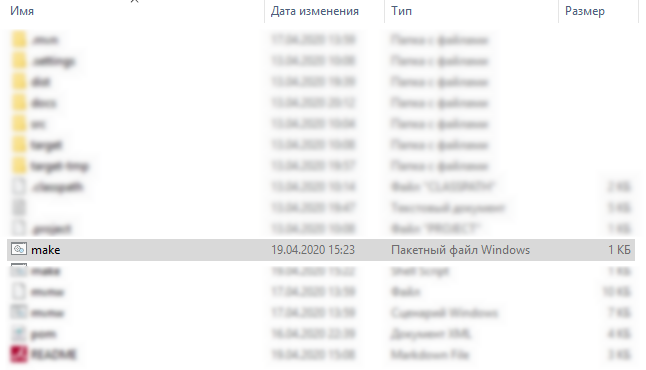
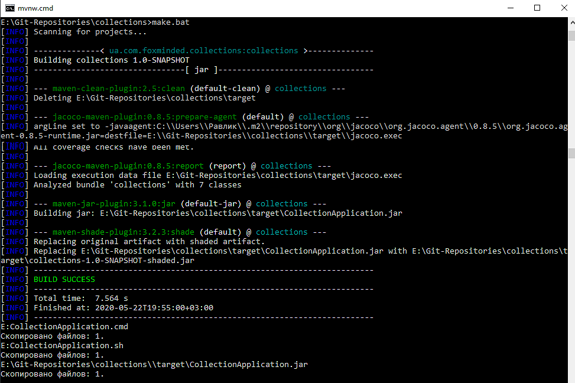
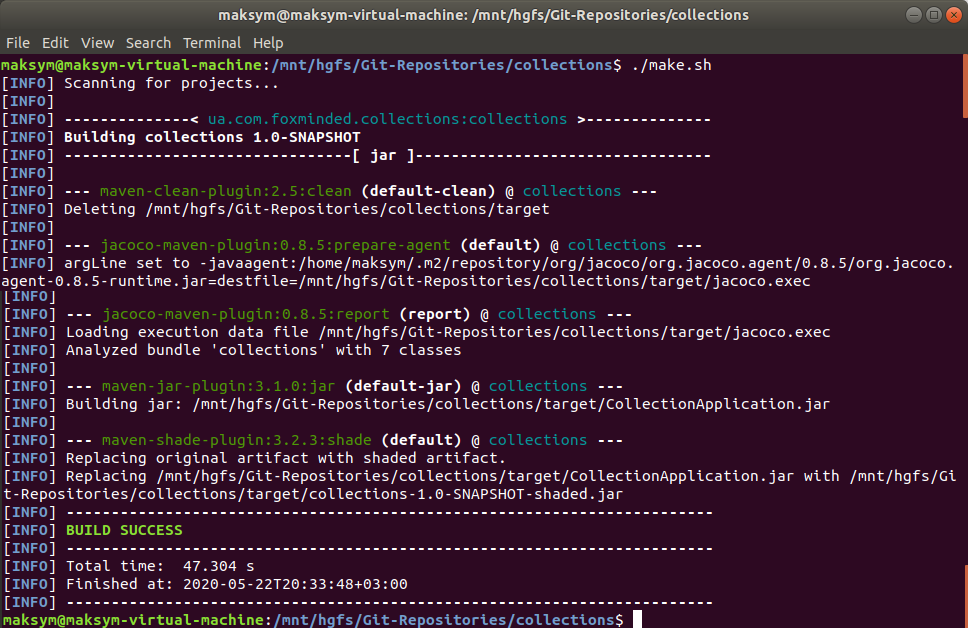
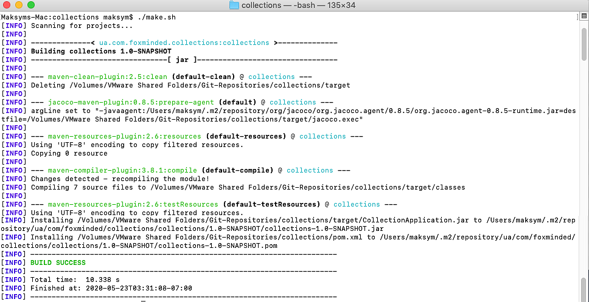
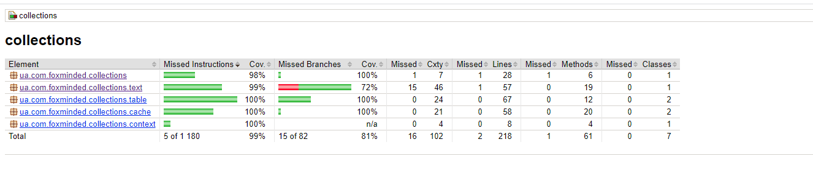

# Collection Framework (Tasks 5) 
## Table of content  
* [Task](#Task)
* [How to build](#How-to-build)
* [File Structure](#File-structure)
* [Dependencies](#Dependencies)
* [Technologies](#Technologies)
* [Information and links](#Information-and-links)
* [Tests coverage report](#Tests-coverage-report)

## Task  
Write an interactive application (reads System.in) that reads lines (strings) from standard-input one by one and counts:

Part-1:   
1) the number of unique characters in the current line
2) how many times the particular character appears in the global text
3) how many vowels and consonants in the current line
4) how many continuous consonant sequences in the line
5) for each symbol the minimal and maximal index of it in the line

Part-2:

It is expected that a string with the same character sequence may be passed several times to the method. Since the counting operation can be time-consuming, the method should cache the results, so that when the method is given a string previously encountered, it will simply retrieve the stored result. Use collections and maps where appropriate. Chose appropriate cache eviction policy and implement it.
Externalize cache config, etc.. into Maven's resource dir application.properties file.
Implement printing like on this example:
```
>: askldjfask; fsdf asd;klfj asdf
Number of unique characters in the current line: 9
Vowels: 4
Consonants: 21
Continuous consonant sequences: 6

+------------+------------+------------+------------+------------+
| Symbol     | Line       | Global     | Min index  | Max index  |
+------------+------------+------------+------------+------------+
| a          | 4          | 7          | 0          | 26         |
| s          | 5          | 8          | 1          | 27         |
| k          | 3          | 5          | 2          | 21         |
| l          | 2          | 3          | 3          | 22         |
| d          | 4          | 7          | 4          | 28         |
| j          | 2          | 4          | 5          | 24         |
| f          | 5          | 8          | 6          | 29         |
| ;          | 2          | 2          | 10         | 20         |
|            | 3          | 5          | 11         | 25         |
+------------+------------+------------+------------+------------+

>: 
```

## How to build:  
Make sure Java Development Kit (JDK) and Maven tool installed on your machine.

There are two options how to build project:

* Windows:
   
   - double-click on `make.bat`:
  

  
   - or use Command Prompt:  navigate to project's root folder and type `make.bat` command:


      
   - or use `mvnw.cmd package` command in Terminal (Maven Wrapper)
   
   - or use `mvn package` command in Terminal (Maven)
      
* Linux/MacOS:

   - execute `make.sh` script file by using `./make.sh` command:
      

      

   
   - or use `./mvnw package` command in Terminal (Maven Wrapper)
   
   - or use `mvn package` command in Terminal with Maven

`make.bat` and `make.sh` will create a `dist` folder with application execution jar, batch + bash files and _README file for users. 

## File structure 
```bash
├── src
│   ├── main
│   │   └── java
|   |       |-- ua/com/foxminded/collections
|   |       |   └── Main.java
|   |       |   
│   │       │── ua/com/foxminded/collections/cache
|   |       |   |-- Cache.java
│   │       │   └── CacheableCharactersCounter.java
│   │       │
│   │       │── ua/com/foxminded/collections/context
│   │       │   └── Context.java
│   │       │
│   │       │── ua/com/foxminded/collections/table
|   |       |   |-- TableCreator.java
│   │       │   └── TableData.java
│   │       │
│   │       └── ua/com/foxminded/collections/text
│   │           └── CaractersCounter.java
│   │           
│   └── test
│       └── java
|           |-- ua/com/foxminded/collections
|           |   └──~~~~ MainTest.java
|           |   
│           │── ua/com/foxminded/collections/cache
|           |   |-- CacheTest.java
│           │   └── CacheableCharactersCounterTest.java
│           │
│           │── ua/com/foxminded/collections/context
│           │   └── ContextTest.java
│           │
│           │── ua/com/foxminded/collections/table
|           |   |-- TableCreatorTest.java
│           │   └── TableDataTest.java
|           │
│           └── ua/com/foxminded/collections/text
│               └── CaractersCounterTest.java
|
├── docs
│   └── img
│       └── *.png
│-- target
├── .gitignore
├── make.bat
├── make.sh
|-- _README.md
└── README.md
```

## Dependencies: 
- JUnit Platform: junit-platform-console-standalone-1.6.0 ([download](https://mvnrepository.com/artifact/org.junit.platform/junit-platform-console-standalone/1.6.0))
- JUnit TestEngine API: junit-jupiter-api-5.6.0 ([download](https://mvnrepository.com/artifact/org.junit.jupiter/junit-jupiter-api/5.6.0))
- Mockito mocking framework for unit tests: mockito-all-1.10.19 ([download](https://mvnrepository.com/artifact/org.mockito/mockito-all/1.10.19))
- JaCoCo - Java Code Coverage Library 0.8.5 ([download](https://mvnrepository.com/artifact/org.jacoco/jacoco-maven-plugin/0.8.5))
- Maven Wrapper ([download](https://mvnrepository.com/artifact/io.takari/maven-wrapper))
- Maven Shade Plugin: maven-shade-plugin-3.2.3 ([download](https://apache.ip-connect.vn.ua/maven/plugins/maven-shade-plugin-3.2.3-source-release.zip))

## Technologies  Project is created with:
* Java EE 1.8
* Junit 5
* Maven

## Information and links 
- Java SE Runtime Environment 8 (JRE) ([download](https://www.oracle.com/technetwork/java/javase/downloads/jre8-downloads-2133155.html))
- Apache Maven ([download](https://maven.apache.org/download.cgi))
- Eclipse ([download](https://www.eclipse.org/downloads/))

## Tests coverage report
  