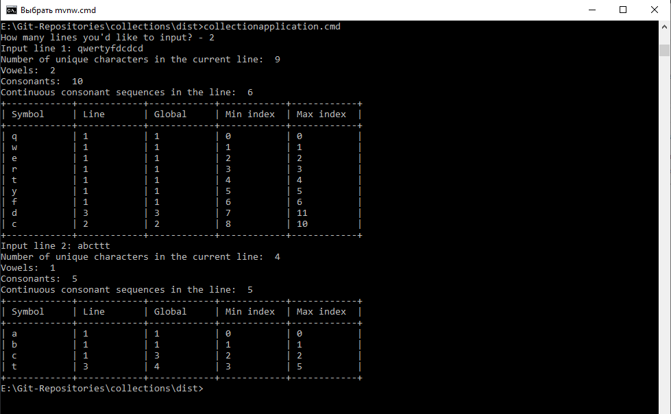
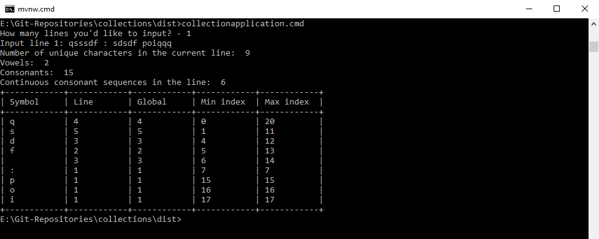
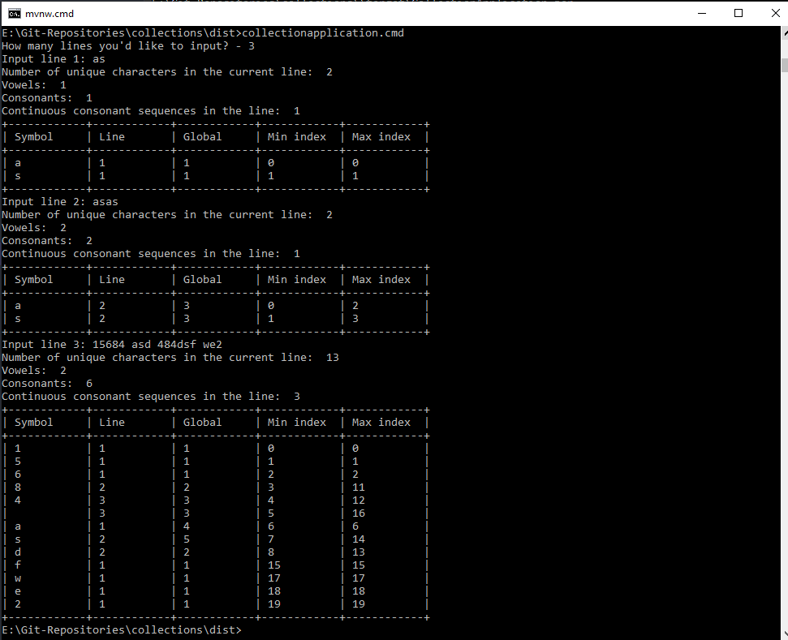
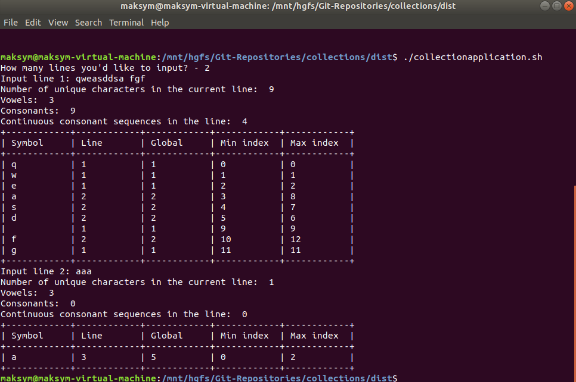
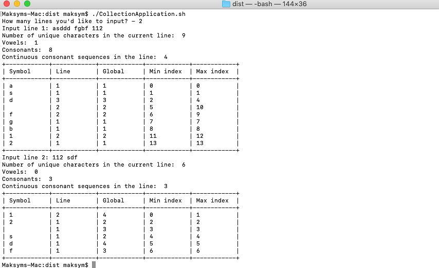
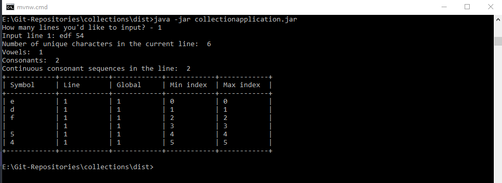
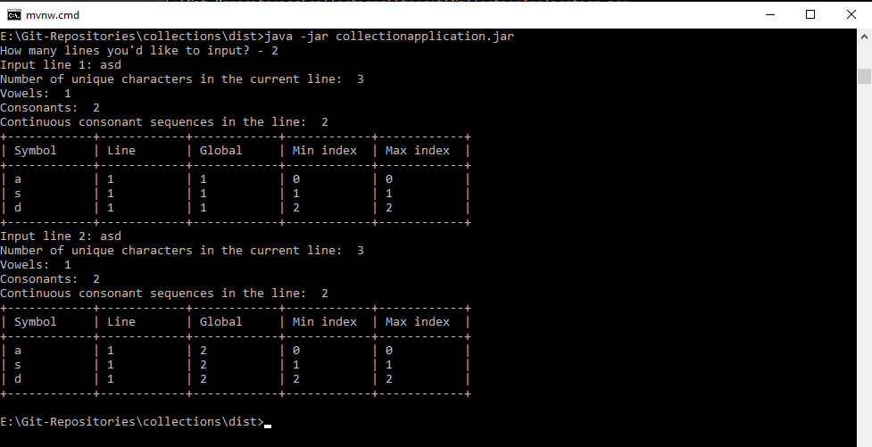
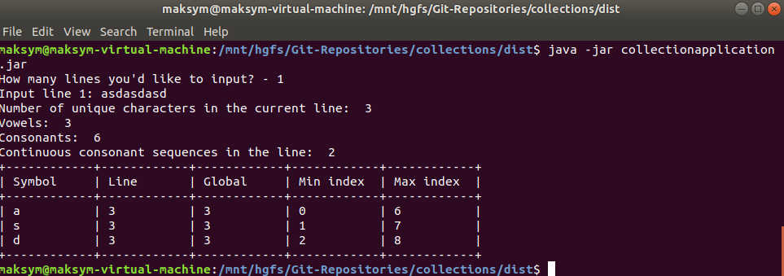
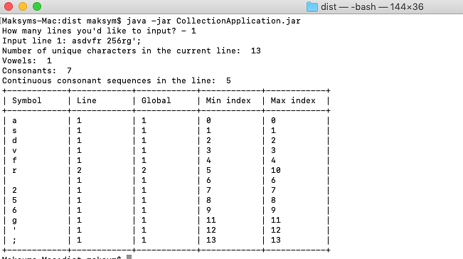

# Collection Application

## Description:

Application that reads lines from input one by one and counts:

1) the number of unique characters in the current line
2) how many times the particular character appears in the global text
3) how many vowels and consonants in the current line
4) how many continuous consonant sequences in the line
5) for each symbol the minimal and maximal index of it in the line

Applications use cache to save already input data and retrieve it if the same line input one more time.

Output example:
```
>: askldjfask; fsdf asd;klfj asdf
Number of unique characters in the current line: 9
Vowels: 4
Consonants: 21
Continuous consonant sequences: 6

+------------+------------+------------+------------+------------+
| Symbol     | Line       | Global     | Min index  | Max index  |
+------------+------------+------------+------------+------------+
| a          | 4          | 7          | 0          | 26         |
| s          | 5          | 8          | 1          | 27         |
| k          | 3          | 5          | 2          | 21         |
| l          | 2          | 3          | 3          | 22         |
| d          | 4          | 7          | 4          | 28         |
| j          | 2          | 4          | 5          | 24         |
| f          | 5          | 8          | 6          | 29         |
| ;          | 2          | 2          | 10         | 20         |
|            | 3          | 5          | 11         | 25         |
+------------+------------+------------+------------+------------+

>: 
```

## How to run:

1. By using CollectionApplication script:

    By sending number of lines to be input and text arguments to batch script using command line:
     
     * In Windows:
        
     1) Open Command line
        
     2) Type `CollectionApplication.cmd` and press `Enter`

     3) Type number of lines to be input:
        > How many lines you'd like to input? - 1
     4) Input text lines one-by-one pressing `Enter` after each of them:
        > Input line 1: qweqw asfsfae sdww34245 
      
     >Notes:
     >* Make sure the `CollectionApplication.jar` is located at the same folder as `CollectionApplication.cmd`.

The result of successful application execution:


	 

	 



   * In Linux/MacOS:

     1) Open Terminal
        
     2) Type `CollectionApplication.sh` and press `Enter`

     3) Type number of lines to be input:
        > How many lines you'd like to input? - 1
     4) Input text lines one-by-one pressing `Enter` after each of them:
        > Input line 1: qweqw asfsfae sdww34245 
      
     >Notes:
     >* Make sure the `CollectionApplication.jar` is located at the same folder as `CollectionApplication.sh`.


The result of successful application execution in Linux:



The result of successful application execution in MacOS:



2. By using Java archive (JAR) file (from dist folder):

* in Windows:


	 

   
* in Linux:


     
* in MacOS:


